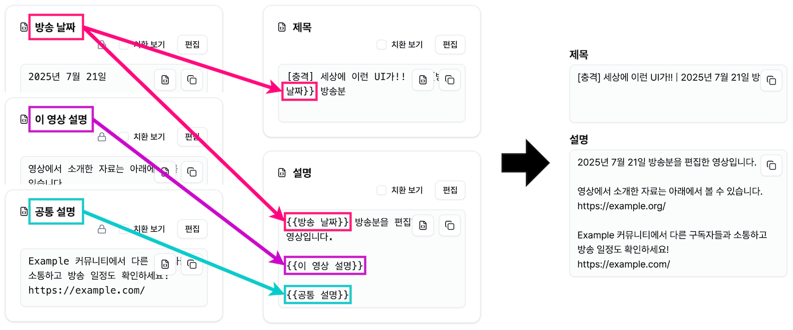
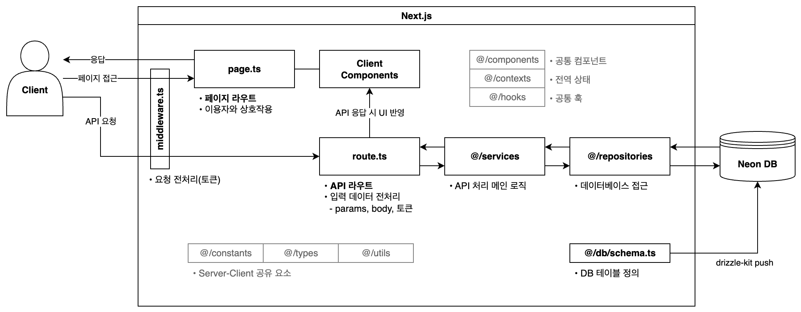

# Text Builder

[**Text Builder**](https://text-builder.vercel.app/)는 형식이 정해진 텍스트에서 필요한 내용만을 빠르게 수정할 수 있도록 도와줍니다. 방대한 텍스트 안에서 고쳐야 하는 부분을 일일이 찾아다니다가 수정을 빼먹는 실수를 줄여 줍니다.



## 기능 및 구조

- 계정 생성, 로그인, 로그아웃
- 자신의 텍스트 매크로 목록 열람 및 텍스트 매크로 생성, 편집, 삭제
- 텍스트 매크로 내 필드 생성, 편집, 삭제, 순서 변경
- 텍스트 매크로 내의 다른 필드를 참조하여 긴 텍스트 추상화
- 결과 텍스트를 클립보드에 복사
- 보기 모드에서 불필요한 필드를 숨기고 복사할 필드만 표시
- 텍스트 매크로마다 계정만의 고유한 URL 적용

## 기술 정보

### 기술 스택

 <br>   <br>    <br>   <br>  [](https://neon.tech/)

### 로컬 실행과 선행 세팅

#### 선행 요구사항

- Node.js (Next.js 15에서 Node.js 18.18 이상 요구)
- pnpm
- PostgreSQL (빈 데이터베이스 준비)

#### 저장소 클론 및 의존성 설치

```sh
git clone https://github.com/yejunian/text-builder.git
cd text-builder
pnpm i
```

#### `.env` 세팅

`.env.template` 파일을 복제하여 `.env` 파일을 생성하고, 텍스트 에디터로 `.env` 파일을 열어서 내용을 채웁니다.

```sh
cp .env.template .env
```

```sh
LOCAL_DATABASE_URL= # 로컬 개발 서버에서 접근할 DB URL
LIVE_DEV_DATABASE_URL= # 로컬 프로덕션에서 접근할 DB URL
LIVE_PROD_DATABASE_URL= # 프로덕션 DB URL (로컬에서 사용하지 않음)

ACCESS_TOKEN_SECRET= # Access token secret
REFRESH_TOKEN_SECRET= # Refresh token secret
```

#### PostgreSQL 데이터베이스 세팅

아직 PostgreSQL 데이터베이스에 테이블을 세팅하지 않았다면, 아래와 같이 `src/db/schema.ts`에 정의된 테이블을 PostgreSQL 데이터베이스에 반영합니다.

```sh
pnpm drizzle-kit push
```

필요에 따라 환경 변수를 제공하여 로컬 개발 서버 외의 다른 환경을 위한 데이터베이스 세팅을 할 수 있습니다.

```sh
# 로컬 프로덕션용 DB에 세팅
NODE_ENV=production pnpm drizzle-kit push

# 실제 배포 DB에 세팅
VERCEL=1 pnpm drizzle-kit push
```

#### 실행

개발 서버를 실행하려면 `dev` 스크립트를 실행하고, 안내에 따라 웹 브라우저에서 `http://localhost:3000/`을 엽니다.

```sh
pnpm dev
```

프로덕션으로 실행하려면 빌드 후 `start` 스크립트를 실행하고, 안내에 따라 웹 브라우저에서 `http://localhost:3000/`을 엽니다.

```sh
pnpm build
pnpm start
```

### 구현 특이사항



#### API

API 요청 핸들링은 Next.js의 route handler(`route.js`, `route.ts`)로 구현했습니다. 최대한 많은 것을 무료로 해결하고 작업을 가능한 한 막힘 없이 빠르게 진행하고자 하는 상황에서, 선택지를 Next.js의 route handler 기능과 Express 정도로 좁혔습니다. Next.js에서 제공하는 기능을 좀 더 사용해 보려는 목적에서 API 구현 수단을 Next.js의 route handler로 최종 선택했습니다.

Route handler와 클라이언트 컴포넌트가 주고받는 데이터의 구조는 공통 타입으로 `src/types` 디렉터리에 빼 놓았습니다. 여기에는 클라이언트 컴포넌트에서 전송하고 route handler가 받는 요청 본문의 타입, route handler에서 전송하고 클라이언트 컴포넌트가 받는 응답 본문의 타입을 정의해 두었습니다.

클라이언트 컴포넌트에서의 API 요청은 Fetch API를 래핑한 함수를 통해 이루어집니다. 래퍼 함수는 매번 직접 호출해야 하는 `JSON.stringify()`를 내부에서 처리해 주고, 객체를 받아 응답 상태 코드에 따른 분기 처리를 할 수 있도록 작성했습니다. 이 래퍼 함수를 hook으로 한번 더 감싸서, 컴포넌트에서 로딩 상태 변경 함수를 전달하면 응답이 돌아올 때까지 그 로딩 상태를 `true`로 설정해 주는 기능도 작성했습니다.

#### 데이터베이스

데이터베이스는 월 한도 내에서 무료로 사용 가능한 서버리스 PostgreSQL 서비스인 Neon에 세팅했습니다. 또한 코드에 SQL 문을 바로 작성하는 대신, DB 쿼리 작성 중 실수를 줄이기 위해 ORM을 사용했습니다. SQL 문과 구조가 비슷하여 진입 장벽이 낮을 것으로 예상되고, 스키마를 TypeScript 파일로 관리할 수 있는 Drizzle ORM으로 결정했습니다.

#### UI

시각디자인 디테일로 인한 작업 지연을 줄이기 위하여, UI의 큰 틀은 Vercel에서 제공하는 v0.dev 서비스로 생성했습니다. 서버를 통해 받을 JSON 데이터와 함께 머릿속에 생각하고 있던 UI 구조의 그림과 기능 설명을 제출해서, 페이지 컴포넌트의 초안을 얻을 수 있었습니다.

#### 상태 관리

전역 상태 관리를 위해서는 별도의 라이브러리를 사용하지 않고, React에서 제공하는 Context를 활용하여 구현했습니다. 라우팅 영역별로 각 상태의 사용 여부가 다르기도 했기 때문입니다. Context provider는 클라이언트 컴포넌트로 감싸서 필요한 곳에 끼워넣었습니다.
